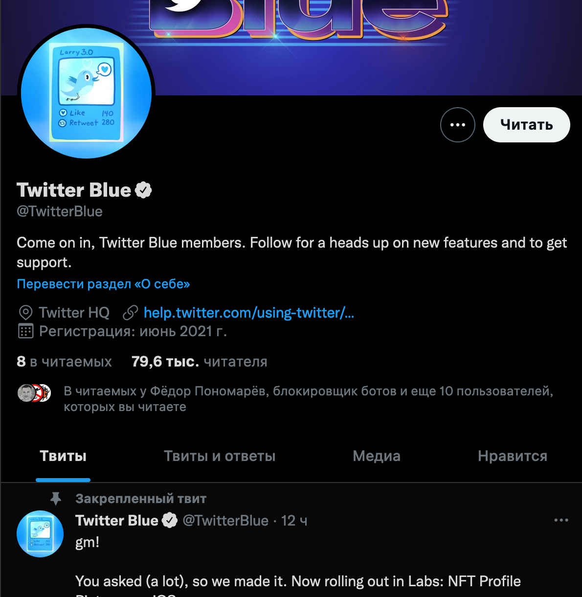
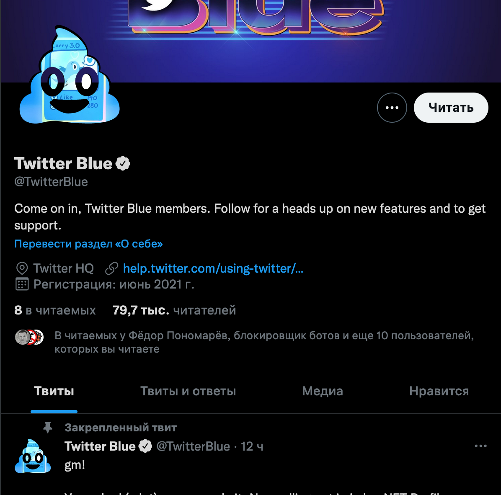

# HexaGone

HexaGone allows you to revert or customize twitter's new hexagonal avatars.

It's a collection of a several userscripts, with different clip masks.

(In case you may consider [following me](https://twitter.com/libneko))

## Installation

To use it, you'll need any userscript extension, tested on ViolentMonkey, but will work on any of these.

## Variants

### Classic

Just returns a circular avatar back.

[Install](https://raw.githubusercontent.com/4ndv/HexaGone/main/HexaGone.user.js)

### Better one

[Install](https://raw.githubusercontent.com/4ndv/HexaGone/main/HexaGonePoo.user.js)

## License

WTFPL, lol.
